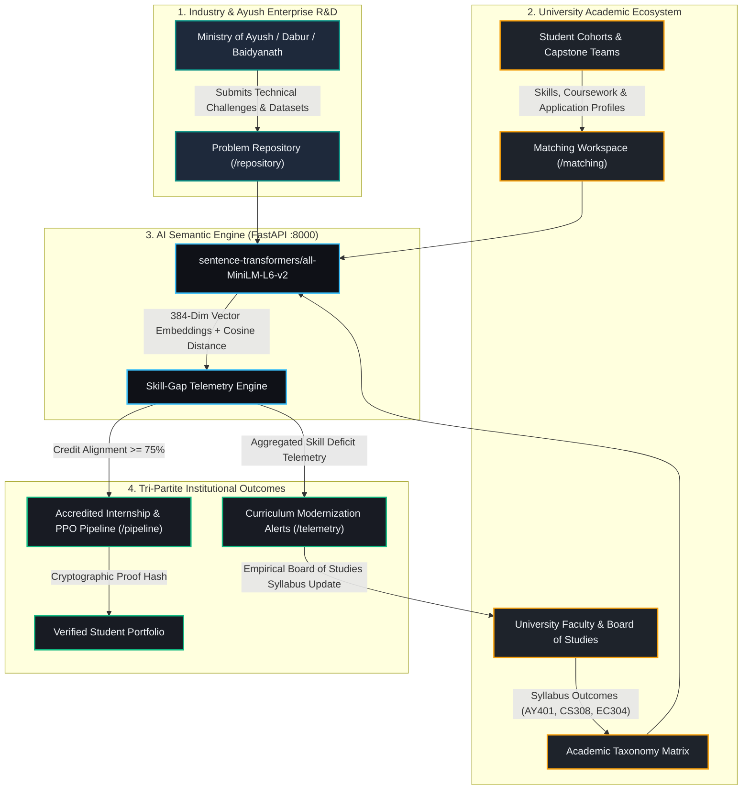

```markdown
<div align="center">

# UNIBRIDGE
### Next-Generation University–Industry Collaboration & Continuous Curriculum Modernization Platform[cite: 1]

[](https://www.sih.gov.in/)
[](https://ayush.gov.in/)
[-1E293B?style=for-the-badge)](https://aiia.gov.in/)

<br />

**"From Academic Knowledge to Industry Solutions — Bridging Higher Education and Industrial R&D"**[cite: 1]  
*Operationalizing National Education Policy (NEP) 2020 & UGC Industry-Linkage Mandates via Closed-Loop Telemetry.*[cite: 1]

</div>

---

## 📌 Problem Statement Overview (PS 26044)

* **Problem ID**: 26044[cite: 2]
* **Problem Title**: Portal for Academia - Industry Collaboration for Skill Mapping, Internships and Placement[cite: 2]
* **Issuing Authority**: Ministry of Ayush | All India Institute of Ayurveda (AIIA)[cite: 2]
* **Category**: Software | **Theme**: Smart Automation & Higher Education[cite: 2]
* **Target Objective**: Eliminate the systemic disconnect between academic instruction and industry needs through an automated portal connecting **Students**, **Academicians**, and **Industry/MSME Enterprises** into a continuous learning-to-placement pipeline[cite: 1, 2].

---

## 🏛️ System Architecture Flow

UNIBRIDGE decouples the traditional linear model ("Study First, Employ Later") into an interconnected, multi-stakeholder feedback loop[cite: 1]:



---

## 🌟 The Four Core Pillars

| Pillar | Endpoint / Service | Institutional Role & Functionality |
| --- | --- | --- |
| **Pillar A: Industry Challenge Repository**<br> | `/repository`<br> | Houses authentic enterprise & Ayush operational bottlenecks (e.g., Computer Vision Botanical Adulteration Detection, IoT Fermentation Control) enforced with rigorous schema requirements: required skills, target deliverables, dataset access, and sprint timelines.

 |
| **Pillar B: AI Semantic Matching Engine**<br> | `/matching` & `unibridge-ai`<br> | Maps industry requirements to UGC course syllabi via vector cosine similarity. Features **Dynamic Skill-Gap Analysis**, instantly partitioning competencies into *Possessed Skills* vs. *Missing Target Skills*.

 |
| **Pillar C: Tri-Partite Placement Pipeline**<br> | `/pipeline`<br> | A 4-stage verified pipeline connecting Capstone Match $\rightarrow$ Joint Mentorship $\rightarrow$ Accredited Internship $\rightarrow$ Pre-Placement Offer (PPO), complete with tamper-proof cryptographic transcript hashes.

 |
| **Pillar D: Curriculum Skill-Gap Telemetry**<br> | `/telemetry`<br> | Aggregates empirical skill deficits across student capstones and streams automated telemetry directly to University Boards of Studies, replacing sluggish 3–5 year syllabus revision cycles with continuous updates.

 |

---

## 🎨 Accessible Dual-Theme System

UniBridge provides a responsive design system meeting WCAG AAA contrast accessibility standards (> 4.5:1), instantly switchable via the header utility controls:

| Design Token | ☀️ Soft Pastel Light Mode

 | 🌙 Warm Charcoal Dark Mode

 | Usage / Context |
| --- | --- | --- | --- |
| **Canvas Background** | `#F8FAFC`<br> | `#121417`<br> | Global page background

 |
| **Surfaces & Cards** | `#EDF2F7`<br> | `#1E232B`<br> | Component surfaces & card containers

 |
| **Primary Accent** | `#0D9488` (Ayurvedic Teal)

 | `#F59E0B` (Warm Amber)

 | Buttons, active badges & highlights

 |
| **Typography** | `#1E293B` (Deep Charcoal)

 | `#F1F5F9` (Crisp Off-White)

 | Headings & high-contrast body text

 |

---

## 📂 Repository Structure

```text
UniBridge/
├── unibridge-web/                    # Next.js 14 Web Portal & Database Layer
│   ├── app/                          # Next.js App Router (Pages & API Endpoints)
│   │   ├── api/                      # Serverless Proxy & Data Handlers
│   │   │   ├── auth/                 # Mock Authentication Endpoints
│   │   │   ├── match/                # Proxy Route to FastAPI AI Microservice
│   │   │   ├── pipeline/             # Placement & Internship Tracking API
│   │   │   ├── problems/             # CRUD Handlers for Industry Challenges
│   │   │   └── telemetry/            # BoS Curriculum Telemetry API
│   │   ├── matching/page.tsx         # AI Vector Match & Skill-Gap Workspace
│   │   ├── pipeline/page.tsx         # 4-Stage Placement & Internship Tracker
│   │   ├── repository/page.tsx       # Live Industry Challenge Repository
│   │   ├── telemetry/page.tsx        # BoS Curriculum Skill-Gap Dashboard
│   │   ├── layout.tsx                # Global Shell with ThemeProvider & Navigation
│   │   └── page.tsx                  # Institutional Landing Page
│   ├── components/                   # Reusable UI Blocks (Header, Modals, Cards)
│   ├── prisma/                       # Prisma Schema & Domain Seed Scripts
│   │   ├── schema.prisma             # Relational Models (User, Problem, Pipeline)
│   │   └── seed.ts                   # Ministry of Ayush / AIIA Seed Data
│   └── tailwind.config.ts            # Extended Color Tokens & Theme Configuration
│
└── unibridge-ai/                     # Python FastAPI AI Semantic Engine
    ├── main.py                       # Vector Embeddings, Cosine Similarity & API
    ├── requirements.txt              # PyTorch, sentence-transformers, FastAPI
    └── venv/                         # Isolated Virtual Environment

```

---

## ⚡ Quick Start Guide

### System Prerequisites

* **Node.js**: v18.0.0 or v20.0.0+
* **Python**: v3.10, v3.11, or v3.12+
* **Database**: PostgreSQL (Production) or SQLite `dev.db` (Local Hackathon Default)

---

### Step 1: Run the AI Semantic Microservice (Port 8000)

```bash
# Navigate to the AI service
cd unibridge-ai

# Activate virtual environment
python3 -m venv venv
source venv/bin/activate

# Install dependencies & launch FastAPI with hot-reload
pip install -r requirements.txt
uvicorn main:app --reload --port 8000

```

> **FastAPI Interactive Swagger Docs**: Open [http://127.0.0.1:8000/docs](http://127.0.0.1:8000/docs?utm_source=gemini) to test `/api/match` directly.

---

### Step 2: Run the Next.js Web Portal (Port 3000)

Open a second terminal window:

```bash
# Navigate to the web frontend
cd unibridge-web

# Install packages & generate Prisma client
npm install
npx prisma generate

# Synchronize database schema and seed Ayush domain datasets
npx prisma db push
npx tsx prisma/seed.ts

# Start development server
npm run dev

```

> **Web Portal Dashboard**: Open [http://localhost:3000](http://localhost:3000?utm_source=gemini) in your browser.

---

## 🧪 Seeded Domain Problems (Ministry of Ayush & AIIA)

The prototype comes pre-seeded with four real-world Ayush and smart engineering challenges:

1. **Computer Vision Botanical Adulteration & Raw Herb Authentication**
* *Industry Partner*: All India Institute of Ayurveda (AIIA) & Dabur R&D
* *Competencies*: Python, PyTorch, OpenCV, Spectral Imaging, ResNet


2. **IoT Telemetry for Temperature & Fermentation Control in Asava/Arishta Formulations**
* *Industry Partner*: Baidyanath Ayurvedic Labs
* *Competencies*: Embedded C++, FreeRTOS, MQTT, ESP32, Time-Series Databases


3. **Ayush EHR: FHIR/ABDM Standardized Clinical Telemetry & Prakriti Assessment**
* *Industry Partner*: Ministry of Ayush Digital Health Mission
* *Competencies*: Next.js, Node.js, PostgreSQL, HL7/FHIR Standards, Microservices


4. **Supply Chain Provenance & Traceability for Medicinal Herb Cultivators**
* *Industry Partner*: National Medicinal Plants Board (NMPB)
* *Competencies*: React Native, Leaflet/GIS, Python FastAPI, Relational Schemas


---

## 🛠️ Full Technical Specifications

* **Frontend & UX**: Next.js 14 (App Router), React 18, TypeScript, Tailwind CSS, Lucide React, Framer Motion, Next-Themes.


* **Database & Persistence**: PostgreSQL / SQLite (`dev.db`), Prisma ORM.


* **AI NLP Pipeline**: Python FastAPI, Uvicorn, Sentence-Transformers (`all-MiniLM-L6-v2`), Scikit-Learn, PyTorch.


* **Governance & Alignment**: NEP 2020 Experiential Learning, UGC Guidelines for Higher Education Industry Linkages, NHEQF Credit Framework.


* **Integrity & Verification**: Role-Based Access Control (RBAC), Institutional 1-Click Demo Profiles, Cryptographic Evaluation Hashes.


```

```
