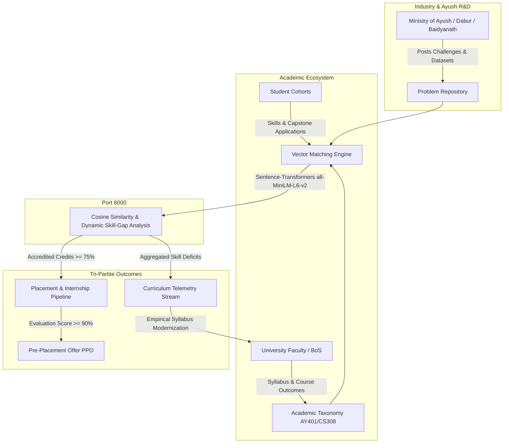

```markdown
# UNIBRIDGE — University-Industry Collaboration & Continuous Curriculum Modernization Platform

> **Smart India Hackathon (SIH 2026) Prototype**[cite: 1]  
> **Problem Statement**: PS 26044[cite: 2]  
> **Organization**: Ministry of Ayush[cite: 2]  
> **Department**: All India Institute of Ayurveda (AIIA)[cite: 2]  
> **Title**: Portal for Academia - Industry Collaboration for Skill Mapping, Internships and Placement[cite: 2]  
> **Category**: Software | **Theme**: Smart Automation & Higher Education[cite: 2]  
> *“From Academic Knowledge to Industry Solutions — Bridging Higher Education and Industrial R&D”*[cite: 1]  
> Operationalizing NEP 2020 & UGC Industry-Linkage Guidelines[cite: 1].

---

## 🏛️ System Architecture Flow (PS 26044: Ministry of Ayush / AIIA)



---

## 🌟 Key Architecture & Pillars

UNIBRIDGE integrates four core pillars into a closed-loop collaboration engine:

1. **Pillar A: Industry Problem Repository** (`/repository`)


* Live repository containing operational Ayush & enterprise R&D bottlenecks (e.g., Computer Vision Botanical Adulteration Detection, IoT Fermentation Telemetry, FHIR Clinical Records).


* Enforces clear deliverable schemas, dataset access parameters, difficulty tags, and sprint milestones.


2. **Pillar B: AI Multi-Dimensional Matching Engine** (`/matching`)


* Python FastAPI microservice utilizing `sentence-transformers/all-MiniLM-L6-v2`.


* 384-dimensional vector embedding engine computing cosine similarity between industry requirements and UGC course learning outcomes.


* **Dynamic Skill-Gap Analysis**: Identifies possessed vs missing skills directly mapped to NEP 2020 credit tiers.


3. **Pillar C: Tri-Partite Collaboration & Placement Pipeline** (`/pipeline`)


* Unified workspace connecting Students, Academicians, and Industry Partners.


* 4-stage verified pipeline: AI Capstone Match → Joint Academic/Industry Evaluation → Accredited Internship → Pre-Placement Offer (PPO) with cryptographic proof hashes.


4. **Pillar D: Curriculum Skill-Gap Telemetry Stream** (`/telemetry`)


* Continuous telemetry dashboard providing empirical skill deficit metrics directly to University Boards of Studies.


* Replaces sluggish 3–5 year syllabus revision cycles with automated curriculum modernization alerts.


---

## 🎨 Dual Theme Palette Specifications

UniBridge implements an instant, zero-lag theme system switchable via the header utility bar:

* ☀️ **Soft Pastel Light Mode**:
* Background: `#F8FAFC`

* Soft Slate-Blue Surfaces: `#EDF2F7`

* Muted Ayurvedic Emerald / Teal: `#0D9488`

* Deep Charcoal Typography: `#1E293B`


* 🌙 **Warm Charcoal & Amber Dark Mode**:
* Warm Charcoal Canvas: `#121417`

* Slate-Gray Card Containers: `#1E232B`

* Warm Amber Primary Accents: `#F59E0B`

* Crisp Off-White Typography: `#F1F5F9`


---

## 🚀 Quick Start Guide

### Prerequisites

* Node.js 18+ or 20+
* Python 3.10+
* PostgreSQL or SQLite (Local default)

### 1. Start the Python FastAPI AI Matching Backend (Port 8000)

```bash
cd unibridge-ai
python3 -m venv venv
source venv/bin/activate
pip install -r requirements.txt
uvicorn main:app --reload --port 8000

```

*API Swagger Documentation available at [http://127.0.0.1:8000/docs](http://127.0.0.1:8000/docs?utm_source=gemini).*

### 2. Start the Next.js 14 Web Portal (Port 3000)

```bash
cd unibridge-web
npm install
npx prisma generate
npx prisma db push
npx tsx prisma/seed.ts
npm run dev

```

*Web Application available at [http://localhost:3000](http://localhost:3000?utm_source=gemini).*

---

## 📊 Tech Stack Specifications

* **Frontend & App Layer**: Next.js 14 (App Router), TypeScript, React 18, Tailwind CSS, Lucide Icons, Framer Motion, Next-Themes.


* **Database & ORM**: PostgreSQL / SQLite (`dev.db`), Prisma ORM.


* **AI Matching Engine**: Python 3.14, FastAPI, Uvicorn, Sentence-Transformers (`all-MiniLM-L6-v2`), Scikit-Learn, PyTorch.


* **Security & Verifications**: Role-based access control, institutional mock authentication profiles, cryptographic evaluation transcript hashes.


```

```
