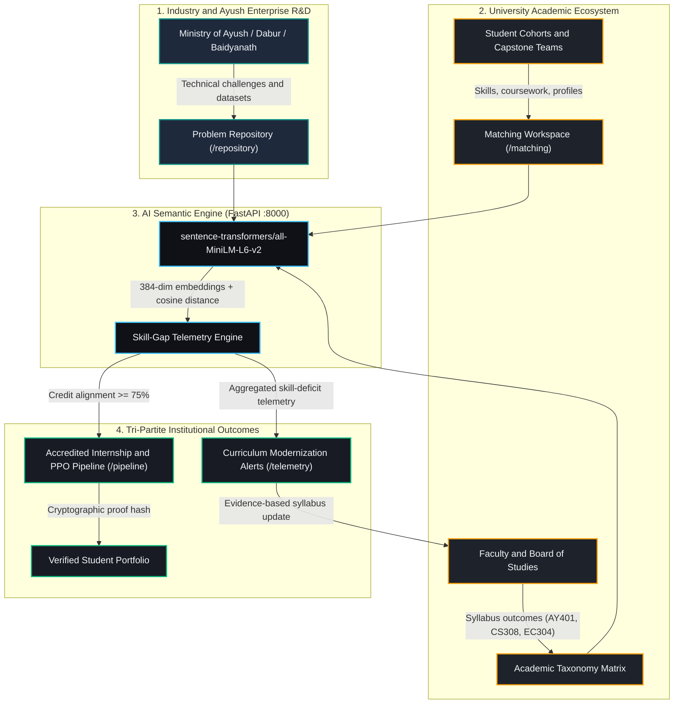

<div align="center">

# UniBridge

### Next-Generation University–Industry Collaboration & Continuous Curriculum Modernization Platform

[](https://www.sih.gov.in/)
[](https://ayush.gov.in/)
[](https://aiia.gov.in/)

<br />

**"From Academic Knowledge to Industry Solutions — Bridging Higher Education and Industrial R&D"**

*Operationalizing NEP 2020 and UGC industry-linkage mandates through closed-loop skill telemetry.*

</div>

---

## Table of Contents

- [Problem Statement](#problem-statement)
- [System Architecture](#system-architecture)
- [Core Pillars](#core-pillars)
- [Theme System](#theme-system)
- [Repository Structure](#repository-structure)
- [Quick Start](#quick-start)
- [Seeded Domain Problems](#seeded-domain-problems)
- [Tech Stack](#tech-stack)

---

## Problem Statement

| | |
| --- | --- |
| **Problem ID** | 26044 |
| **Title** | Portal for Academia–Industry Collaboration for Skill Mapping, Internships and Placement |
| **Issuing Authority** | Ministry of Ayush, All India Institute of Ayurveda (AIIA) |
| **Category / Theme** | Software / Smart Automation & Higher Education |

**Objective:** Close the disconnect between what universities teach and what industry needs. UniBridge connects **students**, **academicians** and **industry / MSME enterprises** in a single, continuous learning-to-placement pipeline.

---

## System Architecture

UniBridge replaces the traditional linear model ("study first, employ later") with a connected, multi-stakeholder feedback loop:



---

## Core Pillars

| Pillar | Route / Service | Role |
| --- | --- | --- |
| **A. Industry Challenge Repository** | `/repository` | Houses real enterprise and Ayush operational problems (e.g. computer-vision botanical adulteration detection, IoT fermentation control). Each challenge follows a strict schema: required skills, deliverables, dataset access and sprint timeline. |
| **B. AI Semantic Matching Engine** | `/matching`, `unibridge-ai` | Maps industry requirements to UGC course syllabi using vector cosine similarity. Its **Dynamic Skill-Gap Analysis** splits competencies into *possessed skills* and *missing target skills*. |
| **C. Tri-Partite Placement Pipeline** | `/pipeline` | A 4-stage verified pipeline: Capstone Match → Joint Mentorship → Accredited Internship → Pre-Placement Offer (PPO), with tamper-proof cryptographic transcript hashes. |
| **D. Curriculum Skill-Gap Telemetry** | `/telemetry` | Aggregates skill deficits across student capstones and streams them to university Boards of Studies, enabling continuous syllabus updates instead of 3–5 year revision cycles. |

---

## Theme System

A responsive dual-theme design system targeting WCAG AAA contrast (above 4.5:1), switchable from the header.

| Design Token | ☀️ Light (Soft Pastel) | 🌙 Dark (Warm Charcoal) | Usage |
| --- | --- | --- | --- |
| **Canvas Background** | `#F8FAFC` | `#121417` | Global page background |
| **Surfaces & Cards** | `#EDF2F7` | `#1E232B` | Component surfaces, card containers |
| **Primary Accent** | `#0D9488` (Ayurvedic Teal) | `#F59E0B` (Warm Amber) | Buttons, active badges, highlights |
| **Typography** | `#1E293B` (Deep Charcoal) | `#F1F5F9` (Crisp Off-White) | Headings and body text |

---

## Repository Structure

```text
UniBridge/
├── unibridge-web/                    # Next.js 14 web portal and database layer
│   ├── app/                          # App Router (pages and API endpoints)
│   │   ├── api/
│   │   │   ├── auth/                 # Mock authentication endpoints
│   │   │   ├── match/                # Proxy route to the FastAPI AI service
│   │   │   ├── pipeline/             # Placement and internship tracking API
│   │   │   ├── problems/             # CRUD handlers for industry challenges
│   │   │   └── telemetry/            # Board of Studies curriculum telemetry API
│   │   ├── matching/page.tsx         # AI vector match and skill-gap workspace
│   │   ├── pipeline/page.tsx         # 4-stage placement and internship tracker
│   │   ├── repository/page.tsx       # Live industry challenge repository
│   │   ├── telemetry/page.tsx        # Curriculum skill-gap dashboard
│   │   ├── layout.tsx                # Global shell: ThemeProvider and navigation
│   │   └── page.tsx                  # Institutional landing page
│   ├── components/                   # Reusable UI blocks (header, modals, cards)
│   ├── prisma/
│   │   ├── schema.prisma             # Relational models (User, Problem, Pipeline)
│   │   └── seed.ts                   # Ministry of Ayush / AIIA seed data
│   └── tailwind.config.ts            # Extended color tokens and theme config
│
└── unibridge-ai/                     # Python FastAPI AI semantic engine
    ├── main.py                       # Embeddings, cosine similarity and API
    ├── requirements.txt              # PyTorch, sentence-transformers, FastAPI
    └── venv/                         # Virtual environment (not committed)
```

---

## Quick Start

### Prerequisites

- **Node.js** v18 or v20+
- **Python** 3.10 – 3.12+
- **Database:** PostgreSQL (production) or SQLite `dev.db` (local default)

### 1. Run the AI semantic service (port 8000)

```bash
cd unibridge-ai

python3 -m venv venv
source venv/bin/activate        # Windows: venv\Scripts\activate

pip install -r requirements.txt
uvicorn main:app --reload --port 8000
```

Interactive API docs: <http://127.0.0.1:8000/docs> (try `/api/match` directly).

> The first run downloads the `all-MiniLM-L6-v2` model weights, so it may take a moment.

### 2. Run the web portal (port 3000)

In a second terminal:

```bash
cd unibridge-web

npm install
npx prisma generate

# Sync the schema and seed the Ayush domain data
npx prisma db push
npx tsx prisma/seed.ts

npm run dev
```

Open <http://localhost:3000> in your browser.

---

## Seeded Domain Problems

The prototype ships with four real-world Ayush and smart-engineering challenges:

1. **Computer Vision Botanical Adulteration & Raw Herb Authentication**
   - *Partner:* AIIA and Dabur R&D
   - *Skills:* Python, PyTorch, OpenCV, Spectral Imaging, ResNet

2. **IoT Telemetry for Temperature & Fermentation Control in Asava/Arishta Formulations**
   - *Partner:* Baidyanath Ayurvedic Labs
   - *Skills:* Embedded C++, FreeRTOS, MQTT, ESP32, Time-Series Databases

3. **Ayush EHR: FHIR/ABDM Standardized Clinical Telemetry & Prakriti Assessment**
   - *Partner:* Ministry of Ayush Digital Health Mission
   - *Skills:* Next.js, Node.js, PostgreSQL, HL7/FHIR, Microservices

4. **Supply Chain Provenance & Traceability for Medicinal Herb Cultivators**
   - *Partner:* National Medicinal Plants Board (NMPB)
   - *Skills:* React Native, Leaflet/GIS, Python FastAPI, Relational Schemas

---

## Tech Stack

| Layer | Technologies |
| --- | --- |
| **Frontend & UX** | Next.js 14 (App Router), React 18, TypeScript, Tailwind CSS, Lucide React, Framer Motion, next-themes |
| **Database** | PostgreSQL / SQLite (`dev.db`), Prisma ORM |
| **AI / NLP** | Python, FastAPI, Uvicorn, Sentence-Transformers (`all-MiniLM-L6-v2`), scikit-learn, PyTorch |
| **Governance & Alignment** | NEP 2020 experiential learning, UGC industry-linkage guidelines, NHEQF credit framework |
| **Integrity & Verification** | Role-based access control (RBAC), one-click demo profiles, cryptographic evaluation hashes |
